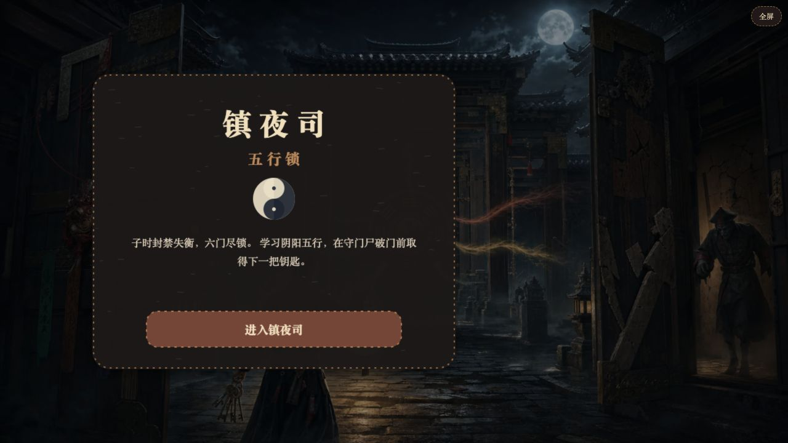
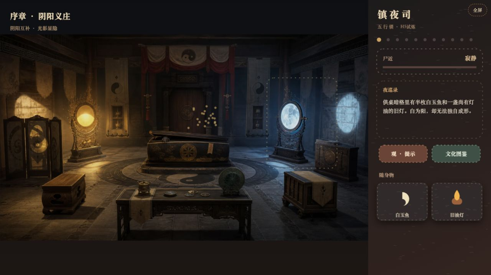
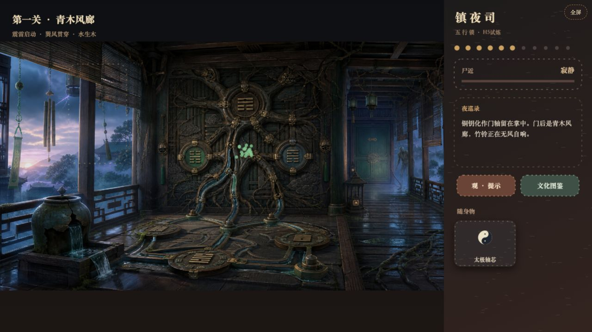
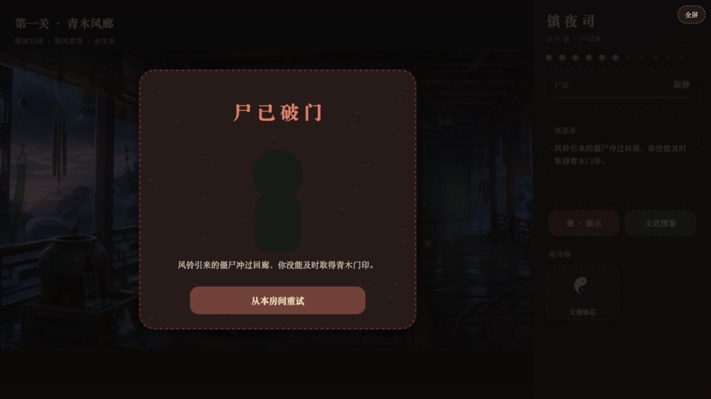
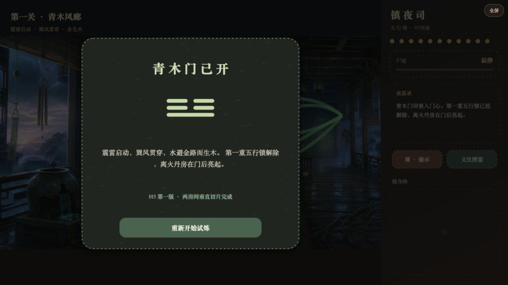

# 《镇夜司：五行锁》游戏介绍与通关说明

试玩地址：<http://47.116.213.118:8083/five-phase-locks/>

## 游戏介绍

《镇夜司：五行锁》是一款国风道家文化密室逃脱 H5。玩家被困在封禁失衡的镇夜司，需要探索房间、收集物件、操作古代机关，并理解阴阳、八卦与五行生克关系，在守门尸破门前取得下一道门的钥匙。

当前版本是约 8–12 分钟的两房间垂直切片，支持横屏、竖屏、拖拽物品、分层提示、文化图鉴、僵尸逼近、死亡与当前房间检查点。

## 当前有几关？

当前共有 **序章 + 第一关** 两个连续房间：

| 顺序 | 房间 | 核心知识 | 主要机关 | 最终道具 |
| --- | --- | --- | --- | --- |
| 序章 | 阴阳义庄 | 阴阳互补、光影显隐 | 日轮、月镜、黑白玉鱼、照影台 | 太极铜钥 |
| 第一关 | 青木风廊 | 震为雷、巽为风、水生木、金克木 | 竹铃、震卦木片、水路、风雷木枢 | 青木门印 |

## 序章「阴阳义庄」怎么通关？

1. 点击前景供桌，取得“白玉鱼”和“旧油灯”。
2. 点击右侧铜镜，取得“黑玉鱼”。拿走黑玉后，棺中守门尸开始逼近。
3. 把“旧油灯”拖到左侧日轮装置，点亮阳面。
4. 把“白玉鱼”和“黑玉鱼”分别拖到中央日月照影台。
5. 在照影台近景中，将日轮旋转 **1 次**、月镜旋转 **3 次**。
6. 点击“合影启匣”，取得“太极铜钥”。
7. 关闭近景，把“太极铜钥”拖到中后方木门，进入下一房间。

提示：前景木凳可以堵住棺盖一次，为本房间增加约 30 秒安全时间。

## 第一关「青木风廊」怎么通关？

1. 点击左侧东方窗格，取得“震卦木片”。震代表雷，也代表发动。
2. 点击左侧竹铃进入近景，依次敲击：**右 → 左 → 中**，取得“巽风丝带”。
3. 点击左下破裂水缸，取得“引水瓢”。
4. 把“太极轴芯”“震卦木片”“巽风丝带”“引水瓢”全部拖到中央风雷木枢。
5. 在水路机关中打开“左木渠”和“右木渠”，保持中央“金管”关闭。
6. 点击“启动木枢”，取得“青木门印”。
7. 关闭近景，把“青木门印”拖到右侧青门，完成当前版本。

这里的规则是：水能滋养木，而金会克制木，因此水流必须避开中央金属管。

## 僵尸威胁与失败

- 义庄中拿走黑玉、风廊中第一次敲响竹铃后，威胁计时才会启动。
- 错误调整光影、连续敲错风铃或让水流经过金管，都会扣除剩余时间。
- 威胁依次表现为接近、撞门、破门和闯入。
- 死亡后选择“从本房间重试”，会保留当前房间入口所需的关键道具，不必从序章重新开始。

## 操作方式

- 点击场景物件：搜索线索、取得道具或打开机关近景。
- 拖动物品栏道具：投放到日轮、照影台、木枢或房门。
- 点击“提示”：获得当前谜题阶段的方向提示。
- 点击“图鉴”：查看已经解锁的阴阳、八卦与五行知识。
- 刷新页面或切换横竖屏：自动恢复当前房间进度。

## 后续章节

产品文档已规划离火丹房、厚土坛室、庚金剑阁、玄水井庭与太极八门终局。第一版验证通过后，将优先制作离火丹房，并评估迁移到 Cocos Creator 和微信小游戏。
