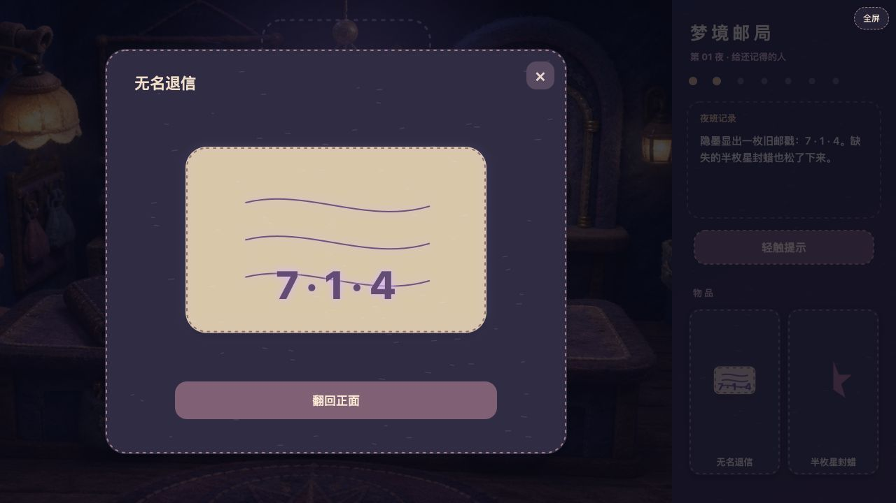

# 《梦境邮局：给还记得的人》游戏介绍

试玩地址：<http://47.116.213.118:8083/dream-post-office/>

## 一句话介绍

这是一款发生在午夜邮局里的原创视觉解谜 H5 游戏。玩家要接替夜班，观察房间里的缝线、月光、邮戳和星图，通过翻面、旋转、拖动、覆盖与组合物件，把一封没有收件人的退信送回它真正应该去的地方。

游戏采用原创 3D 毛毡定格动画风格：羊毛纤维、手工缝线、旧 brass 机关和紫色月光共同构成一个可以被“摸索”的微缩邮局。

## 当前有几关？

当前版本不是多个互相独立的小关卡，而是 **1 个完整章节 / 1 次夜班**，预计游玩时间约 10–15 分钟。

这一章内部由 6 个连续谜题段组成。前一个谜题会改变房间状态，并提供下一个谜题所需的物件或线索：

| 顺序 | 谜题段 | 核心操作 | 解开后发生什么 |
| --- | --- | --- | --- |
| 1 | 夜班记录 | 打开并翻看记录背面 | 得到三层月灯的方向线索 |
| 2 | 三环月灯 | 分别旋转三层软环 | 月灯亮起，房间出现紫色显影光 |
| 3 | 无名退信 | 拿起、翻面、拖到月灯下 | 显示旧邮戳数字 `7 · 1 · 4`，松开半枚封蜡 |
| 4 | 日期邮戳机 | 调整三个数字轮并压下手柄 | 得到一张带孔的星图薄片 |
| 5 | 墙上旧星图 | 旋转薄片并拖到星图上覆盖 | 孔洞套住七颗星，暗格吐出另一半封蜡 |
| 6 | 星形钥匙与投递窗 | 组合封蜡、使用钥匙、投递退信 | 完成这一章的夜班任务 |

## 怎么通关？

### 1. 先看夜班记录

点击柜台左侧的深色记录本，翻到背面。背面的三枚月相缺口依次指向：

**下、右、左。**

### 2. 调整三环月灯

点击房间上方的三环月灯进入近景。三层环从外到内分别调整为：

- 外环：缺口朝下
- 中环：缺口朝右
- 内环：缺口朝左

如果从初始的“缺口朝右”开始，实际操作就是外环顺时针 1 次、中环不动、内环顺时针 2 次。

解开后月灯会亮起，柜台附近出现紫色光晕。

### 3. 让退信显影

点击柜台中央的退信，把它翻到背面，然后从物品栏中把退信拖到月灯下。

隐墨会显示：

**7 · 1 · 4**

同时，信封上的半枚星形封蜡会松开，进入物品栏。

### 4. 校准日期邮戳

点击柜台右侧的邮戳机，把三个数字轮调成：

**7、1、4**

然后压下手柄。数字正确时，会获得“星图薄片”。

### 5. 覆盖墙上星图

在物品栏中点击星图薄片，每次点击会旋转 90 度。将它旋转到正确方向后，拖到墙上的旧星图处。

从初始方向开始，需要顺时针旋转 **3 次**。覆盖成功后，暗格会出现“另一半封蜡”。

### 6. 组合封蜡并完成投递

把物品栏中的“半枚星封蜡”和“另一半封蜡”拖到一起，会合成“星形钥匙”。

接着按顺序操作：

1. 把星形钥匙拖到右上方的投递窗，打开窗锁。
2. 把最初那封“无名退信”拖进已经打开的投递窗。

成功后会进入结局画面，收件人一栏浮现：

**给还记得的人。**

## 操作方式

- 点击场景中的物件：查看或进入近景。
- 点击物品栏中的退信：查看、翻面。
- 点击星图薄片：旋转 90 度。
- 拖动物品：把物件放到机关、星图、投递窗或另一个物件上。
- 竖屏时物品栏会移动到底部，横屏时物品栏位于右侧。
- 卡住时可以点击“提示”，获得当前谜题阶段的方向提示。

## 当前章节结局

本章只有一个完成结局：退信穿过投递窗，收件人一栏写下“给还记得的人”。“另一位夜班员”和这封信真正的收件人身份会留到后续章节展开。
