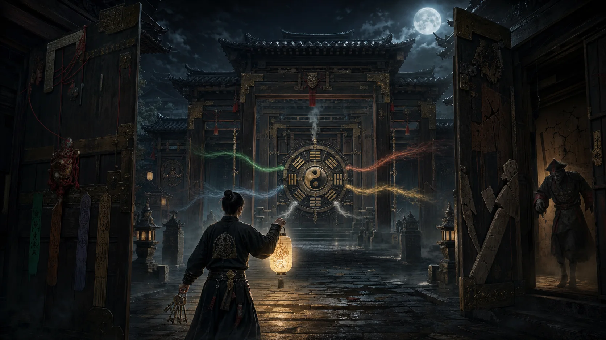
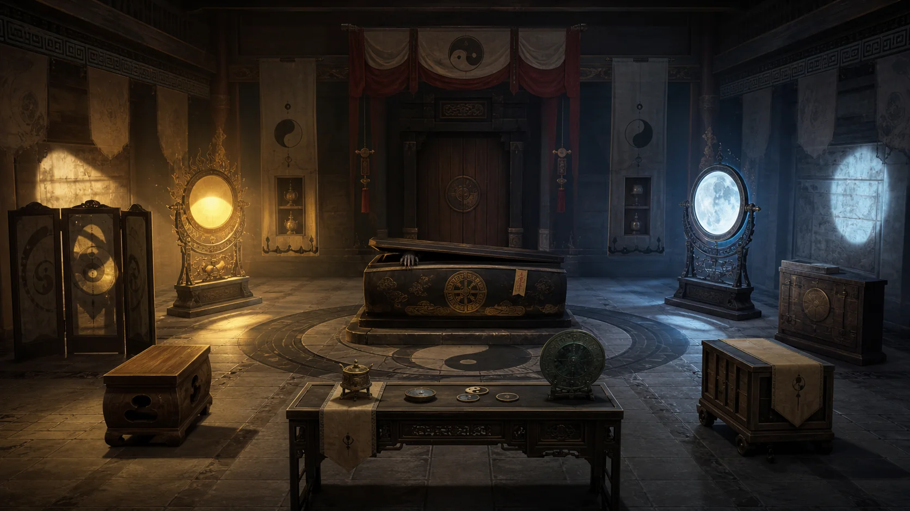
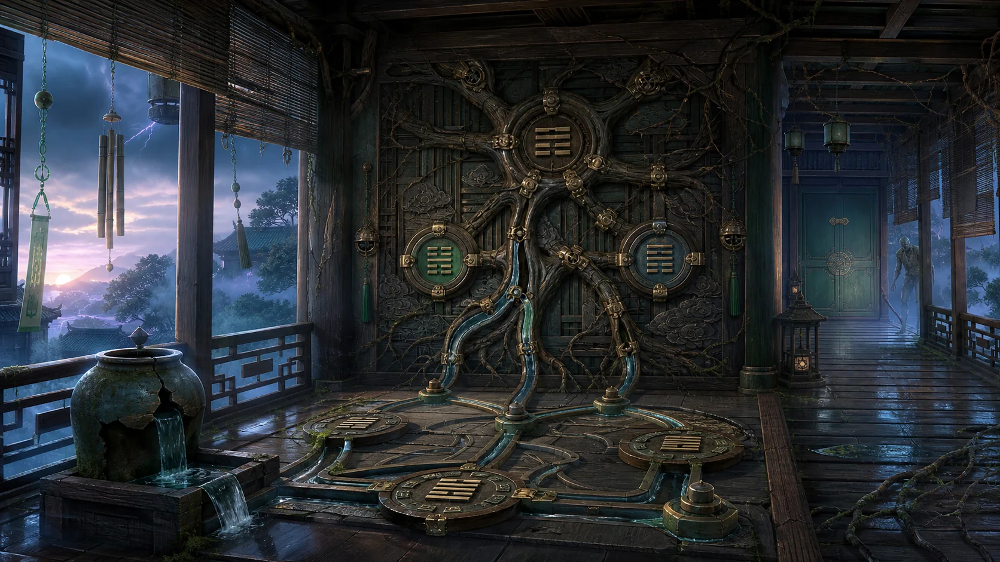
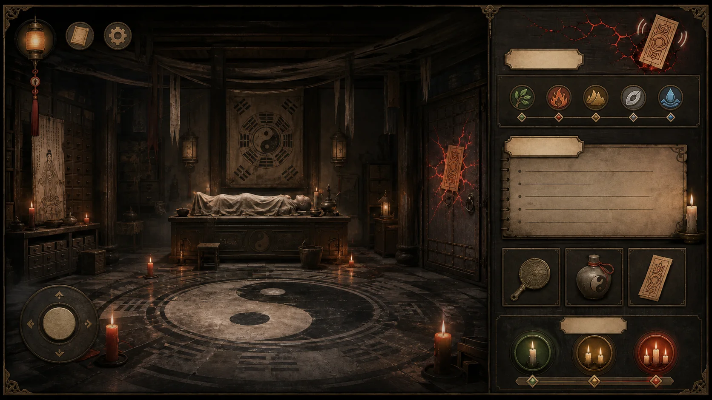

# 《镇夜司：五行锁》视觉概念交付说明

本文件配合 [`taoist-zombie-escape-prd.md`](taoist-zombie-escape-prd.md) 使用。当前图像为 `gpt-image-2` 生成的前期概念稿，用于确定风格、构图、色彩与机关分区；正式游戏制作仍需将场景拆成可交互分层资产，并由程序渲染所有文字与准确卦象。

## 1. 封面主视觉



### 设计目的

- 用连续门廊建立“逐关深入”的产品印象。
- 中央太极八卦锁表现终局目标。
- 五色能量线暗示五行关卡，但避免成为现代霓虹效果。
- 主角手持灯笼和钥匙，明确密室探索身份。
- 侧门僵尸提供威胁，不使用写实血腥表现。

### 后续制作要求

- 预留标题、章节名和按钮区域，文字全部由程序绘制。
- 五色能量需要拆为独立特效层。
- 主角、灯笼、僵尸、雾和门锁分别拆层，支持轻微视差动画。
- 正式八卦盘需由设计师按照准确方位重新绘制。

## 2. 序章“阴阳义庄”场景概念



### 可交互区域

1. 左侧日灯装置：阳光与暖光机关。
2. 中央棺台：威胁入口和投影承接面。
3. 右侧月镜装置：阴影与冷光机关。
4. 前景供桌：太极残片、铜镜和可移动道具。
5. 右侧木柜：隐藏暗格或堵门家具。
6. 中后方木门：本关出口。

### 分层建议

```text
BackgroundArchitecture
SunLightDevice
MoonMirrorDevice
CoffinBase
CoffinLid
ZombieHandShadow
OfferingTable
MovableCabinet
EastExitDoor
ProjectionLightFX
DustAndMistFX
ForegroundOcclusion
```

### 视觉验收重点

- 日灯与月镜必须形成明显冷暖对照。
- 棺盖的威胁状态至少有关闭、轻震、裂开、手臂伸入四级。
- 太极图只能作为规则核心出现，避免全场无意义重复。
- 正式交互热点不得依赖概念图内的细小纹理。

## 3. 第一关“青木风廊”场景概念



### 可交互区域

1. 左侧破裂水缸：水源与管道选择。
2. 左上竹帘和风铃：巽风线索与声音顺序。
3. 中央根系木枢：核心加工设备。
4. 地面水路盘：水生木与金克木的路线判断。
5. 右侧青木门：本关出口。
6. 远端僵尸入口：随噪声逐渐接近。

### 分层建议

```text
CorridorBackground
EastSkyAndThunderFX
BambooBlind
WindChimeSet
RootMechanismBack
RootMechanismMovingParts
WaterJar
WaterChannels
TrigramPlates
GrowingVinesFX
ExitDoor
ZombieThreatLayer
RainAndMistFX
```

### 视觉验收重点

- 震、巽卦象正式制作时必须由矢量或代码绘制，不能沿用AI生成细节。
- 风源、水路、根系和门的空间关系应一眼可读。
- 机关成功后，枯根到青藤的变化需要成为房间级视觉奖励。
- 僵尸应位于侧后方，不遮挡核心设备。

## 4. 横屏UI设计稿



### 布局规则

- 左侧约75%：游戏房间与机关互动。
- 右侧约25%：章节状态、五行进度、记录、物品栏与提示。
- 右上朱砂裂纹：僵尸威胁状态，裂纹越多代表越接近破门。
- 中部五行圆标：章节长期进度，不作为当前关卡倒计时。
- 底部三格：随身物品栏，可拖动到场景或其他物品上。
- 左下圆盘：近景机关的旋转/方向操作控件，仅在需要时出现。

### 程序化UI要求

- 所有中文文本使用项目字体渲染，不能烘焙到背景图。
- 五行图标使用原创SVG或Cocos矢量绘制。
- 威胁裂纹、门符震动和铃铛反馈独立动画。
- 面板背景可九宫格拉伸，适配不同屏幕比例。
- 竖屏版将右侧信息栏改为底部抽屉，场景不强制横屏。

## 5. 视觉资产生产清单

### MVP必须资产

- 封面背景与标题Logo。
- 序章房间背景、前景遮挡、日灯、月镜、棺材、出口门。
- 木关房间背景、风铃、根系装置、水路、出口门。
- 主角手部/道具交互表现。
- 僵尸远景、门后影子、手臂、追逐状态。
- 太极玉片、铜钥、卦象木片、门印等物件图标。
- 横屏和竖屏UI皮肤。
- 五行与八卦的准确矢量图标。
- 朱砂符脉、冷暖投影、根系生长、门板裂纹等特效。

### AI概念图不可直接承担的内容

- 准确的卦象、方位、中文和文化说明文字。
- 可点击物件的独立透明素材。
- 机关逐帧动画和碰撞区域。
- 同一角色多动作一致性。
- 不同状态下完全一致的房间透视。

## 6. 图像提示词

- [`01-key-art.md`](../../art/prompts/taoist-escape/01-key-art.md)
- [`02-yinyang-mortuary-room.md`](../../art/prompts/taoist-escape/02-yinyang-mortuary-room.md)
- [`03-wood-wind-corridor.md`](../../art/prompts/taoist-escape/03-wood-wind-corridor.md)
- [`04-landscape-ui-mockup.md`](../../art/prompts/taoist-escape/04-landscape-ui-mockup.md)
- [`04b-landscape-ui-refine.md`](../../art/prompts/taoist-escape/04b-landscape-ui-refine.md)
